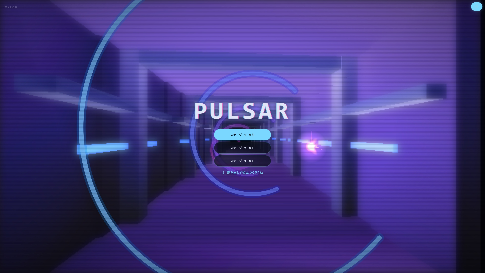

# PULSAR 🌀

PULSAR は、ブラウザ上で動く **メガデモ**（自動再生されるビジュアルデモ）です。
ただ眺めるだけの作品ではなく、**画面に触れるとそのままゲームになります。**

👉 [こちらから見る / 遊べます](https://samoyed130-zen.github.io/pulsar/)
👉 [単体テストの実行結果はこちら](https://samoyed130-zen.github.io/pulsar/test.html)



---

## 作品概要

- 起動すると5つの場面が一周するデモが流れ続けます。タイトル画面がそのまま**アトラクトモード**になっています。最初に映るのは操作区間の自動操縦で、何が遊べる作品なのかを説明ではなく動きで示します。
- タイトルの **スタート** を押すと、そのままトンネルを操縦するゲームへ切り替わります。走り出す前に **READY → 3 → 2 → 1 → START** と数えるので、指の位置を決める間があります。ステージの頭では **STAGE 2** のように番号が添えられ、メニューから戻ったときは添えられません。同じ合図でも「新しいステージが始まる」のか「続きに戻る」のかで意味が違うためです。ステージを開放していれば、ボタンは「ステージ 2 から」のように増えます。
- リングの切れ目を通り抜けると **コンボ** が伸び、溜まるほど **走行速度・曲の厚み・曲のテンポ・画面を流れる集中線** が同時に増していきます。
- 切れ目には**虹色の立方体**が浮かんでいることがあります。触れると持ち時間が4秒延びますが、切れ目の端寄りに置かれているため、安全に抜けるか時間を取りにいくかの選択になります。立方体はゲートに連れられて流れてくるので、「あの切れ目を端で抜ければ拾える」と手前から読めます。
- ぶつかっても終わりません。画面が赤く弾けて減速し、そのまま走り続けます。
- **ステージは全6つ。**持ち時間2分のあいだに 800 進めば次のステージへ（HUD には残りが %で出ます）。抜けると **STAGE 1 / CLEAR!** と出てから次へ進みます。先へ行くほど切れ目が狭くなり、隣り合う切れ目のずれが大きくなり、拾える立体が減り、速度も上がります。
- ステージごとに**通路の色味と照明、うねり方、そして曲そのもの**が変わります。偶数ステージでは通路が左右ではなく上下にうねり、進む感覚が変わります。
- 一度抜けたステージは**端末に記録され**、次回からタイトルで選んで始められます。
- 時間切れで終了。6つすべて抜けると **GAME COMPLETED!** の表示とともに踏破となり、リザルトに祝いの一言が出ます。

### 収録エフェクト

| 場面 | 内容 |
| --- | --- |
| STARFIELD | 星が手前へ流れる。拍に合わせて加速 |
| PLASMA | 正弦波を重ねた色の場。画面全体が脈打つ |
| TUNNEL | **触れると操縦できる区間。**背景は多角形で組んだ巨大建造物の内部 |
| METABALLS | 距離場をしきい値で切った、にじむ塊 |
| COPPER BARS | 横帯の走査と、波打つ横スクロールテキスト |

---

## 操作方法

- **画面をなぞる / マウスを動かす** : 指の向きへ自機が回り込みます。トンネルの中心から見た方向が、そのまま自機の位置です。
- **← → キー** : 自機を左右に回します。押している間はキーが優先され、離してもその場に留まります。もう一度マウスを動かすと、そちらへ主導権が戻ります。左右を同時に押すと打ち消し合ってその場に留まります。
- **触れずに待つ** : 自動操縦に戻り、デモとして流れ続けます。

> **スマートフォンは縦持ちを推奨します。**

### メニュー

画面に常時出しているボタンは **メニュー** の1つだけです。設定はどれも遊びながら触るものではないので、常に並べておく必要がありません。絵を覆う面積が減り、スマートフォンでは特に効きます。

**走行中にメニューを開くと、そのまま一時停止になります。** 閉じると READY → 3 → 2 → 1 と数えてから走り出すので、身構える間があります。「止める」「設定する」「やめる」は同じ場面で使うものなので、入口を1つにまとめました。

止めるのは走っている最中だけです。タイトルで流れているのは自動操縦のデモなので止める理由がなく、むしろ止めると背景や音を切り替えても画面が固まったままで、何が変わったのか分からなくなります。タイトルではデモを流したまま、設定の結果をその場で確かめられます。

| 項目 | 内容 |
| --- | --- |
| 操作感度 | 指の動きに対する自機の機敏さを ×1/4 〜 ×4 の5段階で切り替える |
| ガイドサークル | 自機が動く円を常に出す（既定は なし。出していなくても走り始めだけは出る） |
| 背景 | 立体背景の表示を切り替える（動作が重い端末向け） |
| なめらか | 立体背景の塗り方を切り替える（自前ラスタライザ / Canvas の塗り） |
| ♪ 音 | 音のあり・なし |
| フルスクリーン | 画面いっぱいに表示する（iPhone ではホーム画面への追加を案内） |
| あそびかた | 操作とルールの説明（閉じるとメニューへ戻ります） |
| 疑似グレア固定 | ぼかしを使わないグレアを、判定によらず使う（既定は なし） |
| FPS表示 | 毎秒の枚数と、1枚を描くのにかかった時間を左下に出す（既定は なし） |
| APIテスト | 単体テストを実行し、結果をその場で表示する |
| 設定初期化 | 保存した設定と開放済みステージをすべて消す（確認あり） |
| 再開する / もどる | メニューを閉じる |
| タイトルへ | タイトル画面へ戻る（確認あり） |

設定はすべて端末に保存され、次回も維持されます（操作感度・ガイドサークル・背景・塗り方・音・疑似グレア固定・FPS表示・開放済みステージ）。音は既定で入っていますが、ブラウザの自動再生制限があるため、実際に鳴り始めるのは最初に画面へ触れたときです。

### キーボードショートカット

| キー | 動作 |
| --- | --- |
| <kbd>←</kbd> <kbd>→</kbd> | 自機を回す |
| <kbd>P</kbd> / <kbd>Space</kbd> | メニューの開閉（走行中は一時停止） |
| <kbd>H</kbd> / <kbd>?</kbd> | あそびかたの開閉 |
| <kbd>M</kbd> | 音のあり・なし |
| <kbd>B</kbd> | 立体背景のあり・なし |
| <kbd>R</kbd> | なめらかな塗りのあり・なし |
| <kbd>F</kbd> | フルスクリーンの切り替え |
| <kbd>S</kbd> | 操作感度を次の段階へ |
| <kbd>T</kbd> | タイトルへ戻る（確認あり） |
| <kbd>1</kbd>〜<kbd>6</kbd> | タイトルで、そのステージから開始 |
| <kbd>Enter</kbd> | リザルトでもう一度あそぶ / 確認に「はい」 |
| <kbd>Esc</kbd> | 開いているものを閉じる |

---

## 工夫した点

### 自前の 3D 描画

外部ライブラリを使わずに、頂点の回転・透視変換・裏面消去・面の並べ替え（画家のアルゴリズム）を実装しています。行列も使わず、必要な回転だけを直接書いています。

背景の建造物（壁・床・天井・柱・梁・桁・照明帯）と、拾う立体（八面体・立方体・四面体）は、すべてこの仕組みで描いています。

### 環境マッピングによる金属表現

映り込み用の画像を用意せず、**反射方向から映る景色をその場で計算**しています。反射が上を向けば明るい天井、下を向けば暗い床、横を向けば等間隔に並ぶ照明が映る、という決め方です。実際の周囲と厳密に一致していなくても、面の向きに応じて映り込みが動きさえすれば、目は金属だと解釈します。

これにフレネル反射（浅い角度ほど強く反射し、そこで色が白く飛ぶ）と鏡面反射を重ね、部材ごとに金属らしさを変えています。

### 面の境目を消す

平らな面では法線が一定なので、面ごとに1色で塗ると境目が線として浮きます。しかし**視線の向きは頂点ごとに違う**ため、視線に依存する映り込みを頂点ごとに計算すれば、面の中で明るさが連続的に変化します。

問題は、Canvas 2D に**頂点の色を面の中で混ぜる仕組みがない**ことです。最も暗い頂点と最も明るい頂点を結ぶ直線のグラデーションで近似する方法も用意していますが（「なめらか」を切ったときの塗り方）、3頂点の色を正しく混ぜているわけではありません。

### 自前のソフトウェアラスタライザ

そこで、**三角形を1画素ずつ塗る処理そのものを書きました。**

画素ごとに3辺の内外を判定し、中にあれば**重心座標**で3頂点の色を混ぜて `Uint32Array` へ直接書き込みます。GPU が固定機能として持っているものを、そのまま JavaScript で書き下ろした形です。得られたものは2つあります。

- **本物のグーローシェーディング。** 近似ではなく3頂点の色が正しく混ざるので、面の境目が完全に消えます。稜線を描かなくても形が読み取れるようになりました
- **Z バッファ。** 画素ごとに奥行きを持つので、面を奥から順に並べ替える必要がなくなりました。立体どうしが食い込んでいても正しく見えます

工夫した点は次のとおりです。

- 辺の内外判定の式は1次なので、1画素進むごとの変化量は一定です。毎回計算し直さず**足していくだけ**にしています
- 奥行きは z ではなく **1/z** を補間します。画面上で線形に変化するのは 1/z のほうだからです。色も同じ理由で、奥行きで割ってから混ぜ、最後に掛け戻しています（透視補正）。これを省くと、奥へ長く伸びる壁で色の変化が歪みます
- 色は `ImageData` と同じ並びの32ビット整数1つで書きます。成分ごとに4回書くより速く、`ImageData` の中身を直接指しているので画面へ出すときの詰め替えも要りません
- 何も描かれなかった画素は**透明のまま**にしています。画面へ重ねたとき、背景の残像がそのまま残ります

代償は速度で、画素数がそのまま処理時間になります。画面より粗いバッファ（横 560px）へ描いて引き伸ばす前提にしており、実測で **1フレームあたり約 3ms** です。

**そして、これはブラウザ差への答えにもなりました。** 素の JavaScript しか使わないので、Canvas の実装による速度差がほとんどありません。グラデーションの生成が遅い環境ではむしろこちらが軽く、動作が重いと判定したときも**止めずに解像度だけ落とします**。

### ポストエフェクト（グレア）

画面を 1/4 に縮小して暗部を潰し、ぼかしてから加算で戻しています。縮小してからぼかすので、広がりの割に計算量が小さく済みます。

### ブラウザごとの速度差に合わせる

同じコードでも、ブラウザによって得意不得意が大きく違います。特に **Canvas のぼかし（`filter`）は Firefox で極端に遅く**、そのままだと処理落ちします。面ごとに作り直すグラデーションも同じ性質があります。

対処は2段構えです。

**1. Firefox ではぼかしを使わないグレアに差し替える。**
ぼかしが遅いことは分かっているので、測るまでもありません。ただしこの見分けは名乗り（ユーザーエージェント）頼みで外れることもあるため、メニューの **疑似グレア固定** で、どの環境でもこちらの経路に固定して見比べられるようにしています。

実測任せにすると厄介な問題も起きます。グレアを止めれば速くなる → 「戻せる」と判断して戻す → また遅くなる、という往復に陥り、画面が明滅してしまいます。

ただし単に止めると、光を加算する処理が丸ごと消えるため画面が沈み、暗く見えます。そこで **`filter` を使わずに同じ形を組み立て直しています。** 縮小したバッファの上でなら、`brightness` / `contrast` / `blur` はいずれも合成モードだけで代用できます。

- **暗部潰し（`contrast` の代わり）** : 縮小した画を、自分自身に**乗算**で重ねます。明るさが2乗になるので、暗いところほど大きく沈み、明るいところはほとんど減りません。1回では中間の明るさが残り、光らせたくない壁まで一緒に持ち上がって画面全体が白く濁るため、2回繰り返しています。
- **ぼかし（`blur` の代わり）** : その画を**縦横にずらしながら加算**で積みます。等間隔のずらし加算は、そのまま矩形のぼかしになります。
- **持ち上げ（`brightness` の代わり）** : 積むときに回数で割らず、1回あたりを薄くしたうえで枚数分だけ足します。

ずらし加算は縮小後の1画素より細かくはぼかせないので、粗く縮めすぎると拡大したときに四角い段が見えます。縮小率は本来のグレアと同程度に留め、広がりは回数（5×5=25回）で稼いでいます。縮小後は数十 px 四方しかないため、25回重ねても負荷はごくわずかです。

**沈んだ色と明るさは、塗る側でも補っています。** ただし補い方が違います。

彩度は面の向きによる差を作っていないため、単純に 1.6 倍で構いません。一方、**明るさを倍率で持ち上げるのは避けています。** 明るい面から順に上限へ張り付き、隣り合う面の差が消えて境目だけが段差として浮くためです。代わりに「上限までの残りに対して一定の割合（10%）を足す」形にしました。こうすると、いくら引き上げても上限には届かず、面どうしの明暗の前後関係も保たれます。暗い面ほど大きく持ち上がるので、沈んだ絵を起こす目的にも合っています。

**2. それ以外の環境では、実際にかかった時間を測って落とす。**
1フレームが 22ms を超え続けたら、建造物の見通す区画数と分割数を減らし、自前ラスタライザのバッファを粗くします。Canvas の塗りを使っている場合は、面の塗りを**三角形を割って塗り分ける方式**に切り替えます。三角形を重心から3つに割り、それぞれを「その辺の2頂点と重心の平均の明るさ」で塗るもので、厳密な補間ではありませんが、単色に潰すのと違って面の表情が残ります。

測るうえで外せなかったのが、**開き始めを判断に使わないこと**です。起動直後は音声の初期化やバッファの確保が重なって本来の速さが出ず、そのまま数えると十分に動く端末まで「遅い」と誤判定します（実際に Firefox で、8.7ms で動いているのに落としたままになっていました）。最初の120フレームは測るだけにしています。

戻す条件も持たせましたが、往復を避けるため三重に縛っています。**落とす 22ms と戻す 12ms で基準の差を大きく取り**、**落とすのは45フレーム連続・戻すのは300フレーム連続**と戻す側を慎重にし、**戻すのは一度だけ**にしています。

### 更新は 60 回/秒に抑える

`requestAnimationFrame` は画面の書き換えに合わせて呼ばれるため、120Hz や 240Hz の端末では 1 秒に 240 回まわります。動きの計算は経過時間で行っているので速さは変わりませんが、**描画の負担だけが4倍**になります。ぼかしや1画素ずつの塗りを4倍の回数かけても、目に見える差はありません。

そこで間隔が 15.5ms に満たない呼び出しは描かずに返します。60 の枠（16.67ms）ちょうどで比べないのは、わずかな誤差で1枚おきに落ちて 30 回/秒に見えてしまうためです。

なお **「毎秒の枚数」と「1枚を描くのにかかった時間」は別物**です。4ms で描けていても、間隔が 16.7ms なら 60 枚/秒にしかなりません。混ぜると「250 枚/秒」のような数字になってしまうため、FPS 表示では両方を並べています。

### 止め方を1つにまとめる

一時停止には「メニューや説明を開いた」「タブが隠れた」「合図を出している」「知らせを出している」の4つの理由があります。これを1つの真偽値で扱うと、説明を閉じた拍子に、タブが隠れている分の停止まで解除されてしまいます。

理由ごとに状態を持ち、**ひとつでも立っていれば止まり、すべて解除されたときだけ再開する**形にしました。

画面側でも同じ考え方を通しています。メニュー・あそびかた・確認・テスト結果の4つは、それぞれが別々に止めるのではなく「**どれか1つでも開いているか**」という1つの問いにまとめました。画面ごとに理由を分けると、メニューから説明へ移る一瞬だけ走り出してしまうためです。

走行中かどうかの判断も1か所に置いています。以前は「画面に触れたか」を表す値で見ていたのですが、これはタイトルでデモに触れただけでも立つため、タイトルでメニューを開いた途端にデモが止まり、曲まで痩せるという形で表に出ました。

### 走行中の数値を読ませる

遊んでいる最中は画面の中心を見ているので、数値は**視界の端で読む**ことになります。そのため走行パネルだけは、他の文字の倍近い大きさにしています。置き場所も、視線が集まるトンネルの中心の真上です。

勢いを示すゲージの棒は**置いていません**。代わりに、コンボが段階を上げるたびに**画面を流れる集中線**が増えます。棒の長さを読ませるより、速く見えること自体で伝わるうえ、視線を HUD へ移さずに済みます。段階の区切りは**音の層が増えるしきい値と同じ**にしてあるので、曲が厚くなる瞬間と絵が変わる瞬間が揃い、どちらも同じ手応えとして届きます。線は中心の手前から描き始めます。そこはリングの切れ目を読み取る場所で、覆うと遊びの邪魔になるためです。

出すのは **GOAL（進み具合の%）・TIME・COMBO** の3つだけに絞りました。進み具合を距離ではなく割合にしたのは、この作品の距離の単位を知らない人にも残りが伝わるからです。ステージ番号は走っている間は変わらないうえ、景色と曲で分かるので外し、必要になったとき（メニューを開いたとき）に見出しの上へ出すようにしました。

**数字の位置が動かないこと**も同じくらい重要でした。等幅の書体にするだけでは足りません。桁が増えれば文字数ぶん幅が変わり、`9 → 10` の瞬間に列がずれます。そこで桁数そのものを固定し、足りない桁を `0` で埋めています。

ただし埋めた `0` は**見せていません**。場所だけ取って見えない要素に入れてあるので、`7` と表示されたまま、位置は `007` のときと変わりません。読み上げにも乗りません。

### 画面の大きさに合わせる

文字や余白の大きさを、`:root` にまとめた寸法（`clamp` で上下を止めた `vw + vh`）から決めています。

縦横どちらか一方を基準にすると持ち方で破綻します。縦持ちの携帯では幅が、横向きの画面では高さが足りません。両方を足して平均をとると、どちらの持ち方でも似た大きさに収まります。

画面幅ごとの指定（`@media`）に残したのは「**並べ方を変える**」ことだけです。大きさまでそこに書くと同じ値を二度書くことになり、片方を直し忘れて食い違います（実際に、メニューのボタンだけ小さいままになる不具合を出しました）。

### 音をその場で合成

音源ファイルを一切使わず、Web Audio API ですべての音を生成しています。コンボに応じて鳴る層が増え、走行速度に応じてテンポも変化します。

層は **ドラム → ベース → ハイハット → リード → 高音のアルペジオ → パッド** の順に加わります。最後だけ刻む音ではなく2小節伸びる和音にしているのは、音数を増やし続けても忙しくなるだけで、締めには厚みが要るためです。パッドは少し音程をずらした2本の発振器を重ね、立ち上がりと減衰をゆっくりにしています。

拍は時刻からの割り算ではなく積算で求めているため、テンポが変わっても拍の位置が飛びません。

### 単体テスト

当たり判定・3D 計算・タイムライン・難易度の条件・一時停止の挙動などを 251 件のテストで検証しています。テストは実際に次のバグを検出しました。

- 角度の境界判定が浮動小数の誤差で裏返っていた（`1.3 - 1.0 = 0.30000000000000004`）
- 立方体と四面体の頂点の並び順が全面逆で、裏面消去により立体が丸ごと消える状態だった

更新の速さに遊びが影響されないことも、テストで固定しています。同じ乱数・同じ狙いで 120 回/秒と 30 回/秒を走らせ、通過数と衝突数が一致することを確かめます。動きを経過時間で計算し、リングは「自機の位置を越えた瞬間に一度だけ」判定しているので、刻みが粗くても見逃しは起きません。

テストは設定を切り替える関数もそのまま呼ぶため、**テストを実行するあいだは設定の保存を止めています。** これが無いと、テストのページを開いただけで、その人の感度や開放済みステージが書き換わってしまいます（実際に、テストを開くと全ステージが開放されてしまう不具合が出ました）。保存を1か所にまとめ、そこで止められるようにしてあります。

遊びやすさの条件も数値で固定しています。「どのステージでもリングの間隔は 0.3 秒以上」「切れ目のずれは、その間に回りきれる範囲」「うねりの周期は酔わない範囲」などをテストが見張っているため、調整の過程で遊べない設定にしてしまうと落ちます。

---

## 開発環境

- HTML / CSS / JavaScript（Vanilla）
- Canvas 2D API / Web Audio API / Pointer Events API
- GitHub Pages で公開
- **外部ライブラリは一切使用していません。**（Bootstrap / Tailwind CSS も未使用）

### ファイル構成

```
index.html      画面構成
style.css       スタイル
manifest.json   ホーム画面へ追加したときの設定（全画面で開く）
assets/
  icon.svg      アイコン（図形だけで描いたもの）
  screenshot.jpg この README に載せている画面
src/
  store.js      設定の保存（localStorage の包み。テスト中は書き込まない）
  mathx.js      純粋関数（角度・補間・当たり判定・時間計算）
  raster.js     ソフトウェアラスタライザ（三角形の塗り・Zバッファ）
  mesh3d.js     3D描画（回転・透視変換・裏面消去・環境マッピング）
  sound.js      Web Audio によるシーケンサ
  game.js       トンネル区間の状態と描画
  scenes.js     各エフェクトとタイムライン
  main.js       描画ループ・シーン管理・入力・ポストエフェクト
test.html       単体テストの実行ページ
test/           テストランナーとテスト本体
```

---

## 単体テスト

Node.js が無い環境でも確認できるよう、**依存ゼロのテストランナーを自作**しています。

- ブラウザ : [test.html](https://samoyed130-zen.github.io/pulsar/test.html) を開くだけで実行されます。作品のメニューの **APIテスト** からも、同じ結果をその場で見られます（作品の状態に触れないよう、枠として読み込んでいます）
- コマンドライン : `node test/run-node.js`

どちらも同じ 251 件のテストを実行します。

---

## 動作環境

- Windows 11 / Google Chrome にて動作確認済み
- スマートフォン版 Google Chrome にて動作確認済み（タッチ操作対応）
- **スマートフォンでは縦持ちを推奨します。** 自機は画面中心のまわりを回るため、
  縦持ちの方が指を動かす範囲と自機の動きが一致し、狙いを定めやすくなります
- Firefox でも動作します。Canvas のぼかしが遅いため、グレアだけは合成モードで組み直した別の実装に切り替わります（光の広がり方が少し変わります）
- iPhone / Safari にて動作確認済み（縦持ち・横持ち）
- **ホーム画面に追加すると全画面で遊べます。** iPhone の Safari は要素を全画面にする仕組みに対応していないため、ブラウザのタブから開くとアドレスバーが残ります
- 動作が重い端末では、メニューの **背景** で立体背景を切ることができます
- 音が鳴らない場合は、端末がマナーモード（消音）になっていないかご確認ください

---

## 使用素材とライセンス

| 種類 | 内容 |
| --- | --- |
| 画像・写真・イラスト | なし（アイコンは図形だけで描いた自作の SVG） |
| 音楽・効果音 | なし（すべてその場で合成） |
| フォント | なし（閲覧環境のシステムフォントを指定しているのみ） |
| 外部ライブラリ | なし |
| コード | すべて自作 |

外部素材を一切含まないため、著作権上の問題は発生しません。
また、サーバー通信・Cookie・外部への接続を一切行いません。

---

## ライセンス

MIT License（[LICENSE](./LICENSE) を参照）
