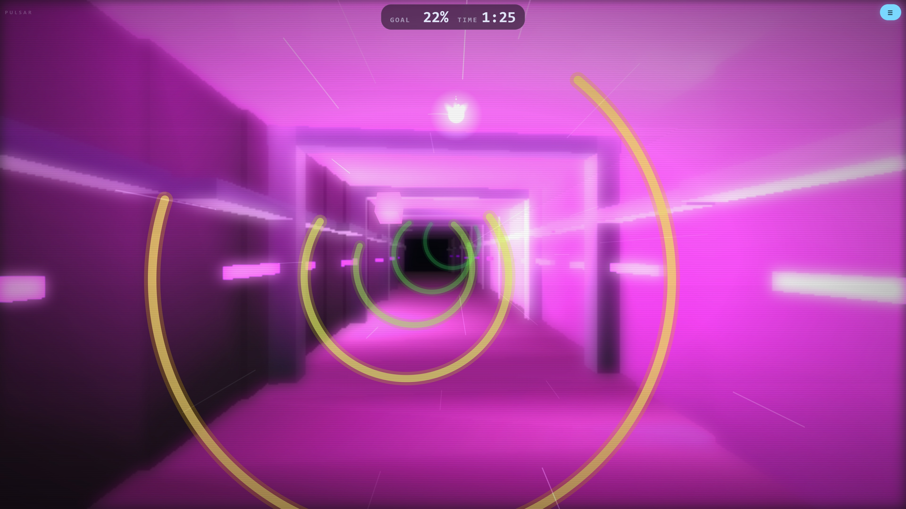
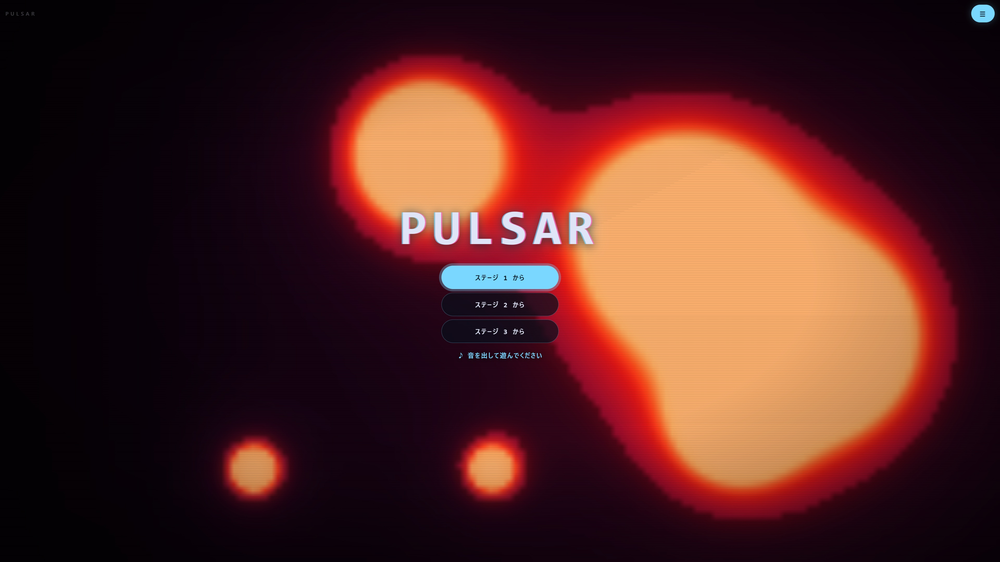

# PULSAR 🌀

PULSAR は、ブラウザ上で動く **メガデモ**（自動再生されるビジュアルデモ）です。
ただ眺めるだけの作品ではなく、**画面に触れるとそのままゲームになります。**

👉 [こちらから見る / 遊べます](https://samoyed130-zen.github.io/pulsar/)
👉 [単体テストの実行結果はこちら](https://samoyed130-zen.github.io/pulsar/test.html)






---

## 作品概要

- 起動すると5つの場面が一周するデモが流れ続けます。タイトル画面がそのまま**アトラクトモード**になっています。最初に映るのは操作区間の自動操縦で、何が遊べる作品なのかを説明ではなく動きで示します。
- タイトルの **スタート** を押すと、そのままトンネルを操縦するゲームへ切り替わります。走り出す前に **READY → 3 → 2 → 1 → START** と数えるので、指の位置を決める間があります。ステージの頭では **STAGE 2** のように番号が添えられ、メニューから戻ったときは添えられません。同じ合図でも「新しいステージが始まる」のか「続きに戻る」のかで意味が違うためです。ステージを開放していれば、ボタンは「ステージ 2 から」のように増えます。
- 操るのは、羽ばたく**光の妖精**です。丸い光そのものを自機にしているので、小さな画面でも自分の位置を見失いません。後ろへ散る光の粉が、奥へ進んでいる向きを伝えます。
- リングの切れ目を通り抜けると **コンボ** が伸び、溜まるほど **走行速度・曲の厚み・曲のテンポ・脇を流れる風の線** が同時に増していきます。
- 切れ目には**虹色の立方体**が浮かんでいることがあります。触れると持ち時間が4秒延びますが、切れ目の端寄りに置かれているため、安全に抜けるか時間を取りにいくかの選択になります。立方体はゲートに連れられて流れてくるので、「あの切れ目を端で抜ければ拾える」と手前から読めます。
- ぶつかっても終わりません。画面が赤く弾けて減速し、そのまま走り続けます。
- **ステージは全6つ。**持ち時間2分のあいだに 800 進めば次のステージへ（HUD には残りが %で出ます）。抜けると **STAGE 1 / CLEAR!** と出てから次へ進みます。先へ行くほど切れ目が狭くなり、隣り合う切れ目のずれが大きくなり、拾える立体が減り、速度も上がります。
- ステージごとに**通路の色味と照明、うねり方、そして曲そのもの**が変わります。偶数ステージでは通路が左右ではなく上下にうねり、進む感覚が変わります。
- 一度抜けたステージは**端末に記録され**、次回からタイトルで選んで始められます。
- 時間切れで終了。6つすべて抜けると **GAME COMPLETED!** の表示とともに踏破となり、リザルトに祝いの一言が出ます。

---

## 操作方法

- **スワイプで動かす** : 動かした量だけ自機が回ります。画面のどこを触っても構いません。上下左右のどちらでも、動かした通りに回ります。
- **マウスを動かす** : マウスの向きへ自機が回り込みます。トンネルの中心から見た方向が、そのまま自機の位置です。
- **← → ↑ ↓ キー** : 自機を輪に沿って回します。上下キーは、押した向きへ自機が回り込みます。押している間はキーが優先され、離してもその場に留まります。もう一度マウスを動かすと、そちらへ主導権が戻ります。反対向きを同時に押すと打ち消し合ってその場に留まります。
- **タイトルで触れずに待つ** : オートプレイ一定時間経過後、幾何学デモが流れます。

> **スマートフォンは縦持ちを推奨します。**

### メニュー

画面に常時出している画面左上のボタンが **メニュー** です。

| 項目 | 内容 |
| --- | --- |
| 操作感度 | 指の動きに対する自機の機敏さを ×1/4 〜 ×4 の5段階で切り替える |
| ガイドサークル | 自機が動く円を常に出す（既定は なし。出していなくても走り始めだけは出る） |
| 背景 | 立体背景の表示を切り替える（動作が重い端末向け） |
| なめらか | 立体背景の塗り方を切り替える（自前ラスタライザ / Canvas の塗り） |
| ♪ 音 | 音のあり・なし |
| フルスクリーン | 画面いっぱいに表示する（iPhone ではホーム画面への追加を案内） |
| あそびかた | 操作とルールの説明（閉じるとメニューへ戻ります） |
| 疑似グレア固定 | ぼかしを使わないグレアを、判定によらず使う（既定は なし） |
| FPS表示 | 毎秒の枚数と、1枚を描くのにかかった時間を左下に出す（既定は なし） |
| APIテスト | 単体テストを実行し、結果をその場で表示する |
| 設定初期化 | 保存した設定と開放済みステージをすべて消す（確認あり） |
| 再開する / もどる | メニューを閉じる |
| タイトルへ | タイトル画面へ戻る（確認あり） |


### キーボードショートカット

| キー | 動作 |
| --- | --- |
| <kbd>←</kbd> <kbd>→</kbd> | 自機を回す |
| <kbd>P</kbd> / <kbd>Space</kbd> | メニューの開閉（走行中は一時停止） |
| <kbd>H</kbd> / <kbd>?</kbd> | あそびかたの開閉 |
| <kbd>M</kbd> | 音のあり・なし |
| <kbd>B</kbd> | 立体背景のあり・なし |
| <kbd>R</kbd> | なめらかな塗りのあり・なし |
| <kbd>F</kbd> | フルスクリーンの切り替え |
| <kbd>S</kbd> | 操作感度を次の段階へ |
| <kbd>T</kbd> | タイトルへ戻る（確認あり） |
| <kbd>1</kbd>〜<kbd>6</kbd> | タイトルで、そのステージから開始 |
| <kbd>Enter</kbd> | リザルトでもう一度あそぶ / 確認に「はい」 |
| <kbd>Esc</kbd> | 開いているものを閉じる |

---

## 工夫した点

### 自前の 3D 描画

外部ライブラリを使わずに、頂点の回転・透視変換・裏面消去・面の並べ替えを実装しています。

背景の建造物と、拾う立体は、すべてこの仕組みで描いています。

カメラも**進む向き**を向きます。投影は真正面しか知らないので、通路の接線を求め、世界の側をその逆に回してから投影しています。曲がるたびに消失点が動き、通路にパースの傾きが出ます。ずれた消失点にはリングと自機も合わせて重ねています。

### ブラウザごとの速度差に合わせる

同じコードでも、ブラウザによって得意不得意が大きく違います。特に **Canvas のぼかし（`filter`）は Firefox で極端に遅く**、そのままだと処理落ちします。面ごとに作り直すグラデーションも同じ性質があります。

対処は2段構えです。

**1. Firefox ではぼかしを使わないグレアに差し替える。**
ぼかしが遅いことは分かっているので、測るまでもありません。ただしこの見分けは名乗り（ユーザーエージェント）頼みで外れることもあるため、メニューの **疑似グレア固定** で、どの環境でもこちらの経路に固定して見比べられるようにしています。

**2. それ以外の環境では、実際にかかった時間を測って動的にフォールバックする。**

### 音をその場で合成

音源ファイルを一切使わず、Web Audio API ですべての音を生成しています。コンボに応じて鳴る層が増え、走行速度に応じてテンポも変化します。

層は **ドラム → ベース → ハイハット → リード → 高音のアルペジオ → パッド** の順に加わります。最後だけ刻む音ではなく2小節伸びる和音にしているのは、音数を増やし続けても忙しくなるだけで、締めには厚みが要るためです。パッドは少し音程をずらした2本の発振器を重ね、立ち上がりと減衰をゆっくりにしています。

拍は時刻からの割り算ではなく積算で求めているため、テンポが変わっても拍の位置が飛びません。

### 単体テスト

当たり判定・3D 計算・タイムライン・難易度の条件・一時停止の挙動などを 273 件のテストで検証しています。テストは実際に次のバグを検出しました。

- 角度の境界判定が浮動小数の誤差で裏返っていた（`1.3 - 1.0 = 0.30000000000000004`）
- 立方体と四面体の頂点の並び順が全面逆で、裏面消去により立体が丸ごと消える状態だった

更新の速さに遊びが影響されないことも、テストで固定しています。同じ乱数・同じ狙いで 120 回/秒と 30 回/秒を走らせ、通過数と衝突数が一致することを確かめます。動きを経過時間で計算し、リングは「自機の位置を越えた瞬間に一度だけ」判定しているので、刻みが粗くても見逃しは起きません。

テストは設定を切り替える関数もそのまま呼ぶため、**テストを実行するあいだは設定の保存を止めています。** これが無いと、テストのページを開いただけで、その人の感度や開放済みステージが書き換わってしまいます（実際に、テストを開くと全ステージが開放されてしまう不具合が出ました）。保存を1か所にまとめ、そこで止められるようにしてあります。

遊びやすさの条件も数値で固定しています。「どのステージでもリングの間隔は 0.3 秒以上」「切れ目のずれは、その間に回りきれる範囲」「うねりの周期は酔わない範囲」などをテストが見張っているため、調整の過程で遊べない設定にしてしまうと落ちます。

---

## 開発環境

- HTML / CSS / JavaScript（Vanilla）
- Canvas 2D API / Web Audio API / Pointer Events API
- GitHub Pages で公開
- **外部ライブラリは一切使用していません。**（Bootstrap / Tailwind CSS も未使用）

### ファイル構成

```
index.html      画面構成
style.css       スタイル
manifest.json   ホーム画面へ追加したときの設定（全画面で開く）
assets/
  icon.svg      アイコン（図形だけで描いたもの）
  screenshot.jpg  この README に載せている画面（タイトル / 操縦中 / METABALLS）
  screenshot2.jpg
  screenshot3.jpg
src/
  store.js      設定の保存（localStorage の包み。テスト中は書き込まない）
  mathx.js      純粋関数（角度・補間・当たり判定・時間計算）
  raster.js     ソフトウェアラスタライザ（三角形の塗り・Zバッファ）
  mesh3d.js     3D描画（回転・透視変換・裏面消去・環境マッピング）
  sound.js      Web Audio によるシーケンサ
  game.js       トンネル区間の状態と描画
  scenes.js     各エフェクトとタイムライン
  main.js       描画ループ・シーン管理・入力・ポストエフェクト
test.html       単体テストの実行ページ
test/           テストランナーとテスト本体
```

---

## 単体テスト

Node.js が無い環境でも確認できるよう、**依存ゼロのテストランナーを自作**しています。

- ブラウザ : [test.html](https://samoyed130-zen.github.io/pulsar/test.html) を開くだけで実行されます。作品のメニューの **APIテスト** からも、同じ結果をその場で見られます（作品の状態に触れないよう、枠として読み込んでいます）
- コマンドライン : `node test/run-node.js`

どちらも同じ 273 件のテストを実行します。

---

## 動作環境

- Windows 11 / Edge / Google Chrome / FireFox にて動作確認済み
- iPhone / Safari / Google Chrome / FireFox にて動作確認済み（縦持ち・横持ち）
- **ホーム画面に追加すると全画面で遊べます。** iPhone の Safari は要素を全画面にする仕組みに対応していないため、ブラウザのタブから開くとアドレスバーが残ります

### 既知の問題

**ページを開いただけでは音が鳴りません。画面に一度触れると鳴り始めます。**

ブラウザは、利用者が一度も操作していないページから音を出すことを禁じています。スマートフォンには例外がなく、こちらで作ったタップ（`dispatchEvent`）は操作として数えられないため、回避する手立てはありません。タイトルはどこを押しても音が起きるようにしてあり、鳴っていない間は「♪ 画面をタップすると音が鳴ります」と出して、何をすれば鳴るのかが分かるようにしています。

音が鳴らないときは、端末がマナーモード（消音）になっていないかもご確認ください。

---

## 使用素材とライセンス

| 種類 | 内容 |
| --- | --- |
| 画像・写真・イラスト | なし（アイコンは図形だけで描いた自作の SVG） |
| 音楽・効果音 | なし（すべてその場で合成） |
| フォント | なし（閲覧環境のシステムフォントを指定しているのみ） |
| 外部ライブラリ | なし |
| コード | すべて自作 |

外部素材を一切含まないため、著作権上の問題は発生しません。

---

## ライセンス

MIT License（[LICENSE](./LICENSE) を参照）
